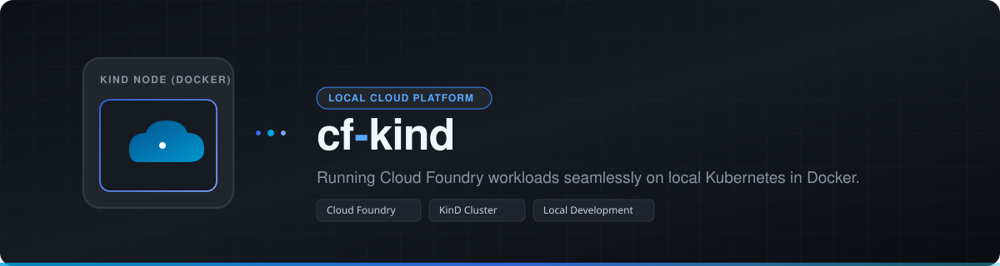

# cf-kind-demo

Cloud Foundry as a demo environment on Apple Silicon Macs, set up and torn down in minutes. Based on
[`cloudfoundry/kind-deployment`](https://github.com/cloudfoundry/kind-deployment).

<p align="center">
  
</p>

Goals:
- **Easy to handle**: one command to set up, one to tear down.
- **Stable across network changes**: all endpoints run via `127.0.0.1`, local DNS resolver, offline too.
- **Airgapped operation possible**: all artifacts come from a local Artifact Keeper.
- **Real TLS certificates**: Let's Encrypt wildcards via DNS-01 (start: `kind.cfapps.cool`) or self-signed.
- **Service marketplace**: MySQL, PostgreSQL 18 + pgvector, Valkey and RabbitMQ via the Open Service Broker API.
- **Developer experience**: web UI in the style of Apps Manager (Stratos) plus demo apps.

Architecture, scope and decisions are in [`CLAUDE.md`](CLAUDE.md), the phases in the
[roadmap](docs/superpowers/plans/2026-09-22-roadmap.md).

## Status

See **[docs/STATUS.md](docs/STATUS.md)** for the current state of every phase: what is done, what is open, and the acceptance criteria.

| Done | In progress | Open |
|---|---|---|
| 0 Prerequisites · 1 Upstream + `kind` · 3 Domain & TLS · L English | 4 Network robustness | 5 Airgap · 6 Services · 7 Developer experience · 8 arm64 buildpacks · 9 `k3d` |

## Prerequisites

See **[docs/PREREQUISITES.md](docs/PREREQUISITES.md)** for the full list: Docker Desktop settings, tools, DNS, Let's Encrypt, and what is changed on your system.

- Mac with Apple Silicon and at least 16 GB RAM (32 GB recommended)
- [Homebrew](https://brew.sh)
- Docker Desktop with Rosetta enabled and its built-in Kubernetes **disabled**. If Docker Desktop is missing, `make prereqs` installs it.

## Quickstart (Phase 0)

```bash
make prereqs                         # checks the Mac and installs missing tools via brew
make configure TLS_MODE=letsencrypt DOMAIN=kind.cfapps.cool ACME_EMAIL=admin@cfapps.cool
make config-show                     # shows the derived system/apps domains
make dns                             # local resolver: *.kind.cfapps.cool -> 127.0.0.1 (asks once for the sudo password)
make secrets-check                   # GCP DNS key for Let's Encrypt present?
```

GCP DNS key for Let's Encrypt, two variants:
- as file `.secrets/gcp-dns-credentials.json` (gitignored, `0600`), plus `make configure ACME_DNS_CREDENTIALS=.secrets/gcp-dns-credentials.json`
- in the macOS Keychain: `make secrets-set-dns FILE=~/sa.json DELETE_SOURCE=1` (default `ACME_DNS_CREDENTIALS=keychain:cf-kind-demo-gcp-dns`)

## Kubernetes access

cf-kind-demo **never** uses `~/.kube/config`. Other projects that use `kubectl` remain untouched.
The demo cluster has its own kubeconfig at `~/.config/cf-kind-demo/kubeconfig`:

```bash
make kubectl ARGS="get pods -A"      # kubectl against the demo cluster
make k9s                             # k9s against the demo cluster
make shell                           # subshell in which kubectl/helm/k9s point to the demo cluster
eval "$(make -s kube-env)"           # set KUBECONFIG in the current shell
```

Without your own domain, `make prereqs` is sufficient: the environment then uses `127-0-0-1.nip.io` with self-signed certificates.

`make` without arguments lists all targets.

## Starting Cloud Foundry

```bash
make up          # cluster + Cloud Foundry + login + buildpacks (first time 5–20 min)
make smoke       # push hello-js and call it via HTTPS
make status      # nodes, pods, CF API
make cf ARGS="apps"
make down        # tear everything down (image caches remain)
```

The cf CLI uses its own `CF_HOME` (`~/.config/cf-kind-demo/cf`); `~/.cf` of other foundations remains untouched.

## Make targets

Run `make` without arguments for the built-in help. The upstream `kind-deployment` Makefile only provides
`init`, `install`, `login`, `create-kind`, `delete-kind`, `create-org`, `bootstrap`, `bootstrap-complete`, `up`, `down`, `smoke` and `cats`.

### Added by cf-kind-demo

| Area | Target | Description |
|---|---|---|
| Prerequisites | `prereqs` | Check this Mac (arch, Docker Desktop, Rosetta, ports, cf CLI, git hooks) and install missing tools via Homebrew |
| | `prereqs-check` | Same checks without installing anything (automatic when `AIRGAP=true`) |
| Configuration | `configure` | Pre-task: set domain, TLS mode, provider etc. (`KEY=VALUE …` or interactive); invalid values are rejected |
| | `config-show` | Show the configuration including derived system/apps domains and certificate SANs |
| Local DNS | `dns` | Local resolver (dnsmasq launch agent + `/etc/resolver`): demo domains resolve to `127.0.0.1`, even offline (asks once for sudo) |
| | `dns-check` | Verify the local resolver |
| | `dns-remove` | Remove the local resolver (sudo) |
| | `dns-activate` | Demo names → `127.0.0.1` (run automatically by `make up`, no sudo) |
| | `dns-deactivate` | Passthrough: demo names resolve via the current network's DNS again (run automatically by `make down`) |
| Public DNS | `dns-public` | Optional: A records `*.sys` / `*.app` / … → `127.0.0.1` in Google Cloud DNS for Macs without the local resolver. They keep resolving to `127.0.0.1` even while the stack is down |
| | `dns-public-remove` | Remove those public records again (only records that point exclusively to `127.0.0.1`) |
| DNS credentials | `secrets-set-dns` | Store the GCP DNS service-account key in the macOS Keychain (`FILE=…`, optional `DELETE_SOURCE=1`) |
| | `secrets-check` | Check that DNS-01 credentials are available |
| Certificates | `certs` | Issue/renew the Let's Encrypt wildcard certificate via DNS-01 when needed (`ACME_ENV=staging\|prod`, `FORCE_RENEW=1`) |
| | `certs-status` | Show days left, SANs and issuer |
| | `certs-cleanup` | Remove stale `_acme-challenge` TXT records (e.g. after an aborted run) |
| | `certs-autorenew` | Install a daily launchd renewal job (`REMOVE=1` removes it) |
| Operations | `status` | Overview: provider, nodes, pods, CF API |
| | `doctor` | Health checks: config, resolver, subnet overlap with the current Wi-Fi, certificate expiry, cluster, CF API, clock drift, global config guard |
| | `repair` | Re-apply provider state and gateway certificate, then run `doctor` |
| Cluster access | `kubectl` | kubectl against the demo cluster via the project kubeconfig (`ARGS="get pods -A"`) |
| | `k9s` | k9s against the demo cluster |
| | `shell` | Subshell with `KUBECONFIG` and `CF_HOME` of the demo (kubectl/helm/k9s/cf usable directly) |
| | `kube-env` | Print export lines: `eval "$(make -s kube-env)"` |
| cf CLI | `cf` | cf CLI against the demo foundation with a project-local `CF_HOME` (`ARGS="apps"`) |
| Upstream | `upstream` | Bring the upstream checkout to the pin in `upstream.lock` and apply `patches/` |
| Repository hygiene | `hooks` | Enable the secret-scanning git hooks (gitleaks on commit and push) |
| | `secrets-scan` | Scan the entire git history and all tracked files for secrets |
| | `lint-language` | List lines that look German (repository content must be English) |
| | `test` | shellcheck + bats unit tests + language check |

### Same name as upstream, extended behaviour

| Target | What cf-kind-demo adds |
|---|---|
| `up` | Activates the local resolver (demo names → `127.0.0.1` only while the stack runs); cluster created by the provider adapter (project kubeconfig, ports bound to `127.0.0.1` only, pinned Docker subnet), domain patch applied, gateway certificate installed, then login + bootstrap |
| `down` | Switches the local resolver to passthrough (demo names resolve normally again) and removes the (empty) Docker network `kind`; image caches, upstream checkout and local config are kept |
| `login` | Project-local `CF_HOME`; password passed via environment, never on the command line; no `--skip-ssl-validation` with a Let's Encrypt prod certificate |
| `bootstrap` | Upstream bootstrap with the upstream tools (e.g. `yq`) provisioned first |
| `smoke` | Pushes `hello-js` and checks it via HTTPS, independent of DNS (`--resolve … 127.0.0.1`) |

Not exposed directly: `init`/`install` (run inside `up`), `create-kind`/`delete-kind` (replaced by the provider adapter),
`create-org` (part of `bootstrap`), `bootstrap-complete` and `cats`.

## Configuration

The defaults are in [`config.env.example`](config.env.example). `make configure` writes local values to `config.env`;
this file is not checked in. Environment variables override both files.

| Layout | Platform | Apps |
|---|---|---|
| `split` (default) | `api.sys.kind.cfapps.cool` | `hello.app.kind.cfapps.cool` |
| `flat` | `api.kind.cfapps.cool` | `hello.kind.cfapps.cool` |

## Development

**Test-driven development** applies (see `CLAUDE.md`, chapter 13.1): first a failing test, then the code.

```bash
make test        # shellcheck + bats unit tests
```

The scripts must run with Bash 3.2, because macOS ships this version.
